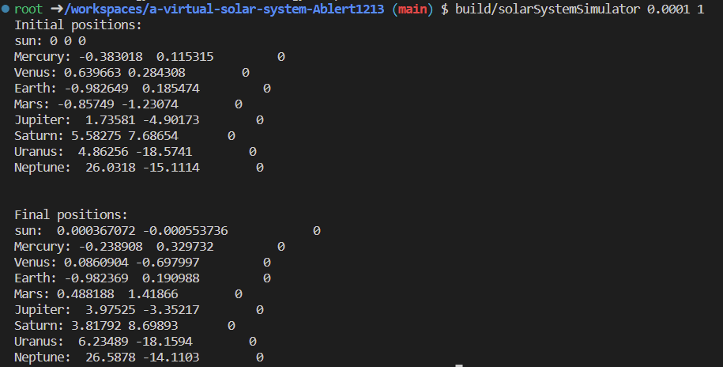

# A Virtual Solar System

This is the starting repository for assignment 2 of PHAS0100: Research Computing with C++. You may add or remove C++ files in any directory. You should organise the files as you see fit but do read the Folder Structure section below to understand the intended use of the existing folders.

## Installing dependencies

We are using the package manager Conan to install the dependencies Catch2 and Eigen. In order to use CMake's `Release` target for performance and `Debug` for debugging, the libraries must be installed twice with:

```
conan install . --output-folder=build --build=missing -s build_type=Debug
conan install . --output-folder=build --build=missing -s build_type=Release
```

If you delete the `build` directory to clean your build, you may have to install the dependencies again.

## Building

To build from the project root directory you should run:

```
cmake -S . -B build -DCMAKE_BUILD_TYPE=Release
cmake --build build
```

If you wish to debug your code, you should replace `Release` with `Debug`. For performance measurements, ensure you have built with the `Release` target.

## Testing

Once the project has been built, it can be tested by running:

```
cd build
ctest
```

## Folder structure

The project is split into four main parts aligning with the folder structure described in [the relevant section in Modern CMake](https://cliutils.gitlab.io/modern-cmake/chapters/basics/structure.html):

- `app/` contains all code implementing the command-line application.
- `lib/` contains all non-app code. Only code in this directory can be accessed by the unit tests.
- `include/` contains all `.hpp` files.
- `test/` contains all unit tests.

You are expected to edit the `CMakeLists.txt` file in each folder to add or remove sources as necessary. For example, if you create a new file `test/particle_test.cpp`, you must add `particle_test.cpp` to the line `add_executable(tests test.cpp)` in `test/CMakeLists.txt`. Please ensure you are comfortable editing these files well before the submission deadline. If you feel you are struggling with the CMake files, please see the Getting Help section of the assignment instructions.

## Usage Instructions

You should fill in the instructions for using the app here.

## Credits

This project is maintained by Dr. Jamie Quinn as part of UCL ARC's course, Research Computing in C++.

## 1.3.e Building the Solar System.

Choose a suitably small dt (timestep) and simulate the system for 1 full year (a time of 2π). This task can be solved by running the command line as:
```
build/solarSystemSimulator <timestep_dt> <num_years>
``` 
The output copy:
Observed from the output, the Earth's positions returns to close to its original position after a time of 2π.


## 2.1 Calculating numerical energy loss results summarizes.

In summary, the total energy drop over a single simulation run varies depending on the time step (dt) used in the simulation. As the time step increases, the simulation becomes less accurate in general, and more energy is lost. This task can be solved by running the command line as:
```
build/solarSystemSimulator2 <timestep_dt> <num_years>
```

Here are the summarized results (run for 100 years) for each run:

dt = 0.1, Initial total energy: -0.000112417, Final total energy: -7.48918e-05, Energy drop: -33.3802%;
dt = 0.01, Initial total energy: -0.000112417, Final total energy: -0.000102496, Energy drop: -8.82516%;
dt = 0.008, Initial total energy: -0.000112417, Final total energy: -0.000103841, Energy drop: -7.62855%;
dt = 0.004, Initial total energy: -0.000112417, Final total energy: -0.000106866, Energy drop: -4.93741%;
dt = 0.001, Initial total energy: -0.000112417, Final total energy: -0.000109813, Energy drop: -2.31664%;
dt = 0.0008, Initial total energy: -0.000112417, Final total energy: -0.00011009, Energy drop: -2.06997%;
dt = 0.0004, Initial total energy: -0.000112417, Final total energy: -0.000110784, Energy drop: -1.45247%;
dt = 0.0001, Initial total energy: -0.000112417, Final total energy: -0.000111695, Energy drop: -0.641777%;

As seen from the results, the energy drop becomes larger when dt is larger, indicating that the simulation is less accurate with a larger time step.

## 2.2 Benchmarking the situation

Run the simulation with compiler optimizations:
```
cmake -S . -B build -DCMAKE_BUILD_TYPE=Release -DCMAKE_CXX_FLAGS="-O2"
cmake --build build
```

Run the simulation without compiler optimizations:
```
cmake -S . -B build -DCMAKE_BUILD_TYPE=Debug -DCMAKE_CXX_FLAGS="-O0"
cmake --build build
```
Based on the performance, the difference with and without complier optimizations is quite significant. With compiler optimizations enabled (using -O2), the average time per timestep remains relatively constant which are ranged from 1.46544e-06 to 1.63359e-06 seconds. However, without compiler optimizations (using -O0), the average time per timestep is much higher, at 5.74133e-05 seconds. So, in this case with same '0.001 100' input, the simulation without complier optimizations ran 0.60123 mins in total which is way more longer than the simulation using -O2 (0.0153516 mins in total).
In terms of accuracy, the total energy drop decreases as the timestep size decreases. To strike a balance between simulation run time and accuracy, a timestep size of 0.001 could be a good choice. With this timestep, the total time is 0.0153516 minutes, and the total energy drop is around -2.31664%. Compared with timestep size of 0.004 the energy drop decreased 53%, and compared with timestep size of 0.0008 the energy drop only less 10%. Which indicates this provides a reasonable simulation run time while maintaining an acceptable level of accuracy. However, under 'a few minutes is reasonable' condition, with timestep 0.00001, it gets -0.103798% of total energy drop after 1.688 minute.

## 2.3 Increasing the scale of the system

With timestep(dt) equal to 0.001 and softening acceleration calculation equal to 0.001 after 1 year (2π time). This task can be solved by running the command line as:
```
build/solarSystemSimulator3 <timestep_dt> <num_years> <softening_factor_epsilon>
```
The performance of the solar system simulator for each case is as follows:

1. 8 initial particles:
Initial energy: -0.0013983
Total time: 0.000178207 mins
Average time per timestep: 1.70175e-06 seconds
Final energy: -0.00125763
Total energy drop: -10.0603%

2. 64 initial particles:
Initial energy: -0.00290945
Total time: 0.00830786 mins
Average time per timestep: 7.93342e-05 seconds
Final energy: -0.00247646
Total energy drop: -14.8822%

3. 256 initial particles:
Initial energy: -0.010686
Total time: 0.129788 mins
Average time per timestep: 0.00123939 seconds
Final energy: 0.2627
Total energy drop: -2558.34%

4. 1024 initial particles:
Initial energy: -0.0474887
Total time: 2.22621 mins
Average time per timestep: 0.0212588 seconds
Final energy: 2.20298
Total energy drop: -4738.95%

5. 2048 initial particles:
Initial energy: -0.112992
Total time: 9.33237 mins
Average time per timestep: 0.0891176 seconds
Final energy: 74.2086
Total energy drop: -65775%

Generally speaking. From the performance results of the solar system simulator, it can be observed that as the number of initial particles increases, the system's initial energy also increases, which should be expected, as more particles contribute to the gravitational potential energy of the system. 
The total energy drops percentage increases significantly as the number of particles increases. This could indicate that the simulation becomes less accurate and stable for larger numbers of particles. Energy conservation might be affected by the increasing complexity of the interactions, numerical errors, or the choice of the timestep.
And with the increase in the number of particles, the total time and average time per timestep required to complete the simulation also increase because the computational complexity increases as more particles are introduced, leading to more calculations required for each timestep.

## 2.4 Parallelising with OpenMP

### a.

1. At the beginning, I parallelise the two for-loops in the 'solarSystemSimulator.cpp' for updating accelerations and position/velocities. Simply use '#pragma omp parallel for' directive.
The simulator run for 1 year with timestep 0.003, softening factor 0.001 and 2048 number of particles, the total time drop from 3.16945 mins (Average time per timestep: 0.0907981 seconds) to 0.914399 mins (Average time per timestep: 0.0261956 seconds), it gets 71% quicker (significant improvement) than the one without parllelising (I take this as benchmark for below experiments). 

##### Experiment with the collapse and schedule clauses and comment on the performance differences.
2. I parallelise the loops that involve adding particles 'void sysSimulator::addSysInput' function by using '#pragma omp parallel for schedule(dynamic) collapse(1)' directive. The simulator with timestep 0.003, softening factor 0.001 and 2048 number of particles, the total time drop from 0.914399 mins (Average time per timestep: 0.0261956 seconds) to 0.79011 mins (Average time per timestep: 0.022635 seconds), it gets 14% quicker than the experiment before without parllelising. 
3. After that, for 'std::vector<double> sysSimulator::kineticEnergyPara' and 'std::vector<double> sysSimulator::potentialEnergyPara' function I use OpenMP's '#pragma omp parallel' directive to create a parallel region where the workload is divided among all cores. And I parallelized the loop by using '#pragma omp for'. Theoretically, the program should take the advantage of multi-cores processors and speedup the performance. However, the total time increases from 0.79011 mins (Average time per timestep: 0.022635 seconds) to 1.02161 mins (Average time per timestep: 0.0292669 seconds). 
4. The next experiment, I turn off the parallelisations from experiment 2, and parallelisated the loops that involve computing the sum of total energy 'double sysSimulator::sumTotalEnergy' function by using '#pragma omp parallel for reduction(+:sum_tot_energy)' directive. The simulator with timestep 0.003, softening factor 0.001 and 2048 number of particles, the total time increases from 0.79011 mins (Average time per timestep: 0.022635 seconds) to 0.932914 mins (Average time per timestep: 0.026726 seconds).  
5. Moreover, I parallelise the loop that involves the calculation of the sum of accelerations 'void particleAcceleration::sumAcceleration' function by using '#pragma omp parallel for schedule(dynamic) reduction(+:sumAcceleration_i)' directive.The simulator with timestep 0.003, softening factor 0.001 and 2048 number of particles, the total time increases from 0.932914 mins (Average time per timestep: 0.026726 seconds) to 1.45148 mins (Average time per timestep: 0.0415817 seconds).
6. In this experiment I turn all above parallelisations on. The simulator with timestep 0.003, softening factor 0.001 and 2048 number of particles, the total time increases from 1.45148 mins (Average time per timestep: 0.0415817 seconds) to 1.89858 mins (Average time per timestep: 0.0543902 seconds). All experiment 3, 4 and 5 receive worse performance, which could be these following reasons: It may because the problem size is not large enough the overhead might overshadow the potential speedup obtained from parallelization. And it could be the parallelisation strategy does not efficiently utilize the available resources and does not effectively reduce the problem size, therefore the performance might get worse.
Due to the limitation of the laptop, I can not simulate with really large particles number. But after several benchmarking, implementing different parallelisations strategies and measuring each of the execution time in this part. I keep the code only with the parallelistion strategies made in experiment 1 and 2.

### b.
In the part, I compiled the code with the optimization level set to -O2, and the parallelistion strategy decided in (a.) as benchmark. This task can be solved by running the command line as:
```
for n in 1 2 3 4 5 6 7 8; do OMP_NUM_THREADS=$n ./build/solarSystemSimulator3 0.003 1 0.001 2048; done
```
And for both experiments, the simulator run for 1 year with timestep 0.003, softening factor 0.001.
  
For the Strong Scaling Experiment, I run the simulations with different thread counts, starting form 1 and increasing up to the number 10 and with certain <num_particles> = 2048. The runtime with a single thread is larger than 30 seconds. Running simulation with:
```
OMP_NUM_THREADS= <num_threads> ./build/solarSystemSimulator3 0.003 1 0.001 2048
```
  | 'OMP_NUM_THREADS' | Time(<units>) | Speedup |
  |---|---|---|
  | 1 | 2.92736 mins |-------|
  | 2 | 1.64597 mins | 1.78x |
  | 3 | 1.33830 mins | 2.19x |
  | 4 | 1.14702 mins | 2.55x |
  | 5 | 1.13136 mins | 2.59x |
  | 6 | 1.06746 mins | 2.74x |
  | 7 | 1.05932 mins | 2.76x |
  | 8 | 1.05127 mins | 2.78x |

The strong scaling experiment shows that as the number of threads increases, the overall execution time decreases, and the speedup factor increases. This is expected, as the workload is divided among more threads, allowing the computation to be completed more quickly. However, the speedup does not scale linearly with the number of threads (the idea scaling or perfect scaling in a strong scaling experiment would be a linear improvement). For instance, going from 1 to 2 threads results in a 1.78x speedup, and going from 1 to 8 threads results in a 2.78x speedup. This indicates that there are diminishing returns as more threads are added.

For the weak scaling experiment, I run the simulations with the same thread counts as in the strong scaling experiment, but increase the number of particles proportionally to the number of threads. (In this case, I choose to start at 768 and increase 768 particles each time). Running simulation with:
```
particles=(768 1536 2304 3072 3840 4608 5376 6144); index=0; for n in 1 2 3 4 5 6 7 8; do OMP_NUM_THREADS=$n ./build/solarSystemSimulator3 0.003 1 0.001 ${particles[index]}; index=$((index+1)); done
```
  | 'OMP_NUM_THREADS' | Num Particles | Time(<units>) | Speedup |
  |---|---|---|---|
  | 1  | 768  | 0.40972 mins |--------|
  | 2  | 1536 | 1.07313 mins | 0.382x |
  | 3  | 2304 | 1.94924 mins | 0.210x |
  | 4  | 3072 | 2.83431 mins | 0.145x |
  | 5  | 3840 | 4.85071 mins | 0.084x |
  | 6  | 4608 | 6.49706 mins | 0.063x |
  | 7  | 5376 | 8.25128 mins | 0.049x |
  | 8  | 6144 | 10.3054 mins | 0.039x |

The weak scaling experiment demonstrates that as the number of threads and the problem size (number of particles) both increase, the execution time increases, and the speedup factor decreases. This result is expected, as the workload grows proportionally with the number of threads, and there is a constant amount of work per thread. However, the speedup factor decreases more quickly than expected suggesting that the performance might not scale well with the problem size. For an ideal weak scaling, the execution time should remain roughly constant as the number of particles and threads increase proportionally, which meaning that the workload per thread stays constant. In such cases, the speedup factor would likely deviate from 1 because the performance scales with the square of the number of particles.
